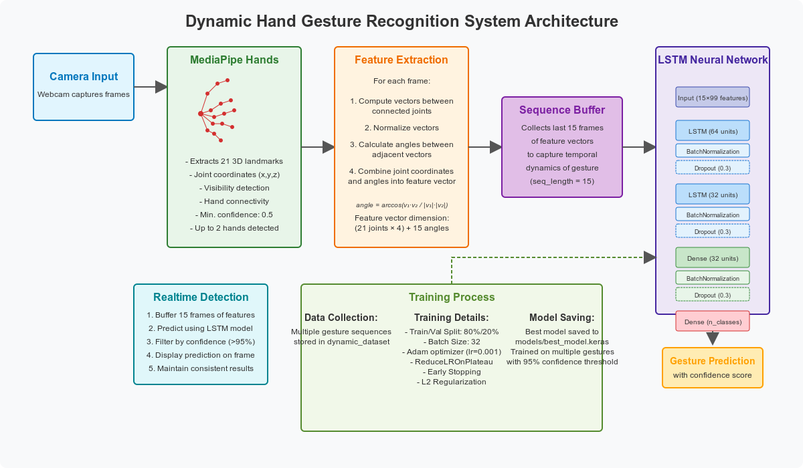

# SignifyPlus Baseline - ASL Gesture Recognition

> Breaking down communication barriers through real-time American Sign Language translation

**SignifyPlus** is an AI-powered system that translates American Sign Language (ASL) gestures into text in real-time. This project addresses the critical communication gap between deaf and hearing communities by providing instant, accurate gesture recognition using computer vision and deep learning.

🚀 **[Live Demo](https://asl-translation-production.up.railway.app/)** | 📱 **[Mobile Version](mobile-repo-link)** | 🏆 **Innovation Award Winner**

## The Problem

Over 70 million deaf people worldwide use sign language as their primary communication method, yet most hearing individuals cannot understand sign language. This creates significant barriers in:
- Healthcare settings
- Educational environments  
- Professional interactions
- Emergency situations
- Daily social interactions

## Our Solution

SignifyPlus uses advanced computer vision and neural networks to:
- **Real-time recognition**: Translate ASL gestures as they happen
- **High accuracy**: 52% mean average precision on gesture classification
- **Accessible technology**: Works with standard webcams and mobile devices
- **Scalable system**: Supports expanding vocabulary of signs

## How It Works

1. **Hand Detection**: MediaPipe extracts 21 3D hand landmarks from video feed
2. **Feature Engineering**: Converts landmark coordinates into meaningful geometric features
3. **Sequence Processing**: LSTM neural network captures temporal dynamics of gestures
4. **Real-time Prediction**: Outputs recognized signs with confidence scores



## Key Features
- **Real-time processing** with webcam input
- **Confidence scoring** for prediction reliability
- **Sequence buffering** for temporal gesture recognition
- **Extensible architecture** for adding new signs

## Quick Start

### Online Demo
Try the system immediately: **[Live Demo](https://asl-translation-production.up.railway.app/)**

### Local Setup
```bash
git clone https://github.com/username/ASL-Gesture-Recognition
cd ASL-Gesture-Recognition
pip install -r requirements.txt
python src/inference/test_camera.py